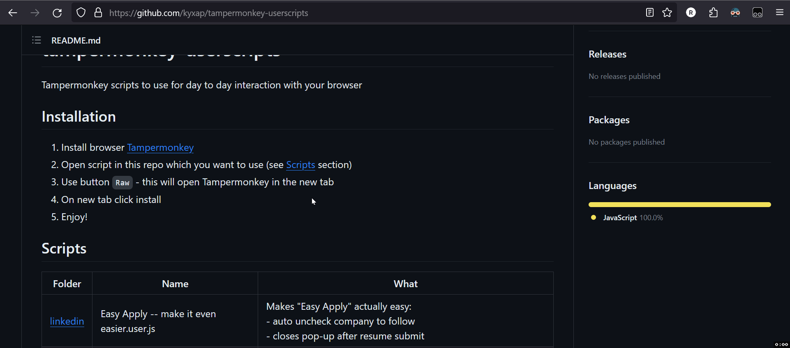

# tampermonkey-userscripts

Tampermonkey scripts to use for day to day interaction with your browser

## Installation

1. Install browser [Tampermonkey](https://tampermonkey.net/)
2. Open script in this repo which you want to use (see [Scripts](#Scripts) section)
3. Use button `Raw` - this will open Tampermonkey in the new tab
4. On new tab click install
5. Enjoy!

  
Visualised installation steps

## Scripts

| Install link                                                                                                                                     | Name                                      | What                                                                                                                                                                                                 |
|--------------------------------------------------------------------------------------------------------------------------------------------------|-------------------------------------------|------------------------------------------------------------------------------------------------------------------------------------------------------------------------------------------------------|
| [linkedin](https://github.com/kyxap/tampermonkey-userscripts/raw/refs/heads/main/linkedin/Easy%20Apply%20--%20make%20it%20even%20easier.user.js) | Easy Apply -- make it even easier.user.js | Makes "Easy Apply" actually easy:   - auto uncheck company to follow  - closes pop-up after resume submit                                                                                    |
| [linkedin](https://github.com/kyxap/tampermonkey-userscripts/raw/refs/heads/main/linkedin/Easy%20Apply%20--%20make%20it%20even%20easier.user.js) | Unfollow all companies.user.js            | Unfollows all companies from your [list](https://www.linkedin.com/mynetwork/network-manager/company/). Less noise in your feed                                                                       |
| [linkedin](https://github.com/kyxap/tampermonkey-userscripts/raw/refs/heads/main/linkedin/JobDescriptionCopier.user.js)                          | JobDescriptionCopier.user.js              | New UI button to copy job description, intend to be used with your AI model for resume generation or comparing against CV                                                                            |
| microsoft/cards                                                                                                                                  | Use all 3 scripts                         | Helps use get microsoft rewords points daily from cards. AI model can be used to perform user like searches. (Ships separately)                                                                      |
| microsoft/pc-searches                                                                                                                            | Use all 3 scripts                         | Helps use get microsoft rewords points daily for pc-searches. AI model can be used to perform user like searches (Ships separately)                                                                  |
| [trustedhousesitters](https://github.com/kyxap/tampermonkey-userscripts/raw/refs/heads/main/trustedhousesitters/new-sits-updates.user.js)        | new-sits-updates.user.js                  | Looks for new sits and inform you via telegram bot integration. You don't need to rely on their system since it very slow and most of the time you get notified where a lot of people alredy applied |

## Issues, requests, feedback ?

Please create an issue in the project if any.

## License

This work is licensed under a
[Creative Commons Attribution-NonCommercial-ShareAlike 4.0 International License][cc-by-nc-sa].

[![CC BY-NC-SA 4.0][cc-by-nc-sa-image]][cc-by-nc-sa]

[cc-by-nc-sa]: http://creativecommons.org/licenses/by-nc-sa/4.0/

[cc-by-nc-sa-image]: https://licensebuttons.net/l/by-nc-sa/4.0/88x31.png

[cc-by-nc-sa-shield]: https://img.shields.io/badge/License-CC%20BY--NC--SA%204.0-lightgrey.svg
